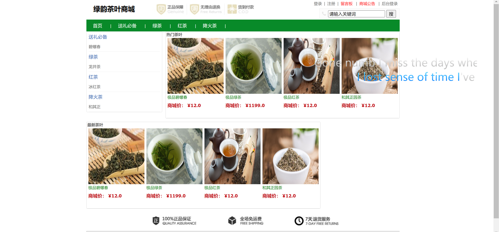
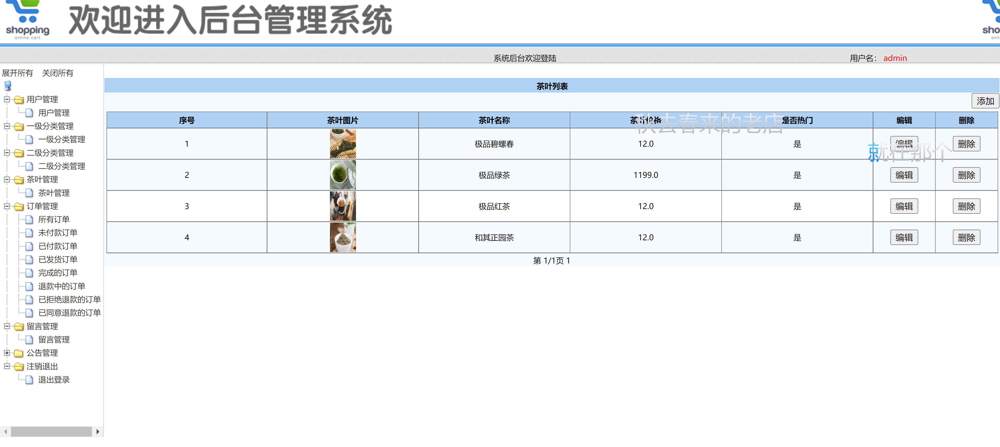

<h1 align="center">茶叶商城管理系统</h1>

## 简介
茶叶商城管理系统：角色分为管理员、用户；包括商品管理、订单管理、用户账户管理、购物车、分类浏览等功能，提供便捷的在线购物体验。    --计算机毕业设计源码；毕设源码；java毕业设计源码

## 联系方式

<h3 align="center">获取完整代码与数据库文件 + 微信：deepguan QQ: 86050149 QQ群: 783742310</h3>

<h3 align="center">可帮忙远程部署 包运行成功！提供远程部署、修改代码、设计文档指导、代码讲解等服务！</h3>

## 功能介绍（完整见运行截图）
管理员：基本功能包括用户管理、订单管理、茶叶管理、分类管理、留言管理和公告管理，支持对用户信息和权限的管理；可以查看和处理订单，包括状态更新和历史查询；能够增删改查茶叶商品信息，并对商品分类进行整理。提供消息处理和系统公告发布，确保后台管理有效运作。

用户：基本功能包括登录、注册和退出，方便用户访问和管理个人账户；通过网站浏览各种茶叶，查看详细信息并添加至购物车，支持在线付款以完成购买；可以管理个人订单，查看订单状态、历史记录，并申请退款；个人中心提供信息查看与修改，提高用户账户安全性和使用便捷性。

## 运行截图

本代码来源于网络,仅供学习参考使用!

